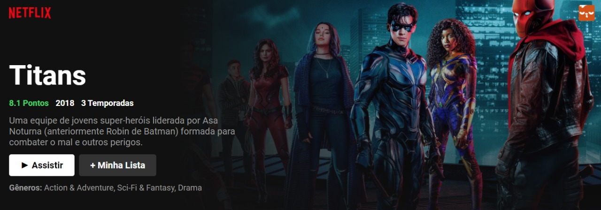

# Clone Netflix com React
## Projeto criado no curso da b7web clone do Netflix com react.

 
 

---

---
## 🌟 Tecnologias 

Projeto foi desenvolvido com as seguintes tecnologias

- [ReactJS](https://pt-br.reactjs.org/)
- [Tmdb API](https://developers.themoviedb.org/3/movies/get-movie-details)
- [Javascript](https://developer.mozilla.org/pt-BR/)

## Protótipo do projeto: 

pode ser testado acessando o link [Clone Netflix](/)

## Como executar:

- Clone o repositório
- Use o `npm install` no terminal na pasta do projeto
- Inicie o servidor com `npm start` no terminal

---

criado por Anderson Jorge na live da b7web React,  em agosto de 2021.